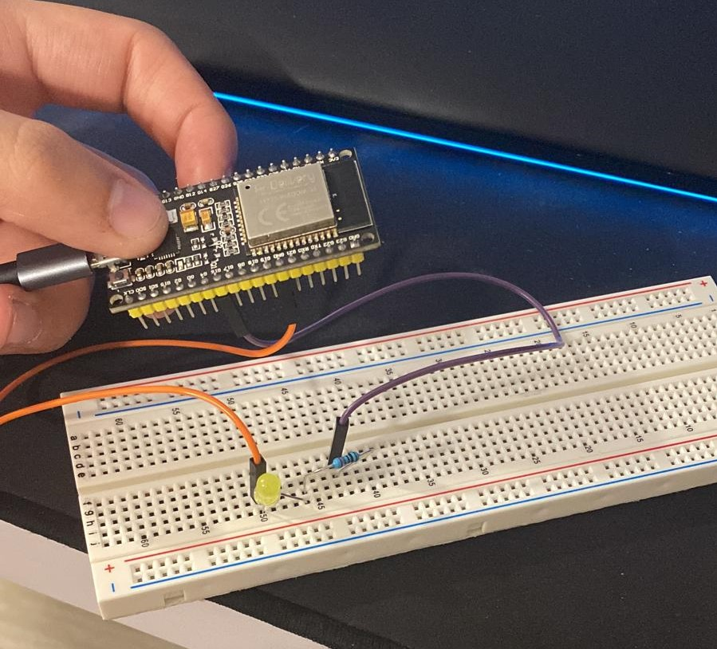

###                                    

    Processadors Digitals

#   PRÁCTICA 1  :  Blink

## Materiales
1 Led
2 Cables macho-hembra
1 Resistencia 220 ohms
1 ESP32

##   1. Código 

#include <Arduino.h>

#define LED 16

void setup(){
Serial.begin(9600);
pinMode(LED,OUTPUT);

}

void loop(){

digitalWrite(LED, HIGH);
Serial.println("ON");
delay(500);
digitalWrite(LED, LOW);
Serial.println("OFF");

}

##   2.Fotos del circuito

Como podemos ver en la foto, he conectado el pin 16 a la resistencia que esta haciendo contacto con el LED.
En el otro lado podemos ver como he conectado GND a la otra pata del LED.

