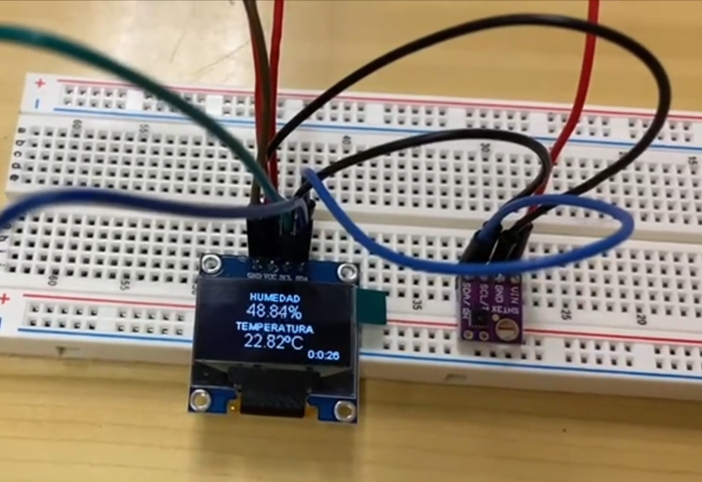

###                                    

    Processadors Digitals

#   PRÁCTICA 5  :  Buses de comunicación I (introducción y I2c)

## Materiales
1 ESP32
1 Cable USB
1 Sensor temperatura y humedad I2C
1 display

##   3.1 Código web Sensor

#include "WiFi.h"
#include "ESPAsyncWebServer.h"
#include <Arduino.h>
#include <Wire.h>
#include "Adafruit_SHT31.h"
#include "SPI.h"
 
// Replace with your network credentials
const char* ssid = "Xiaomi_11T_Pro";
const char* password = "f5CBD8A82232";
 
Adafruit_SHT31 sht31 = Adafruit_SHT31();
 
// Create AsyncWebServer object on port 80
AsyncWebServer server(80);
 
  String readSHT31Temperature(){
  
  float t = sht31.readTemperature();
 
  if (! sht31.begin(0x44))        // Set to 0x45 for alternate i2c addr
{ 
Serial.println("SHT31 test");
while (1) delay(1);
}
 
  if (isnan(t)) {    
    Serial.println("Failed to read temperature!");
    return "--";
  }
  else {
    Serial.print("");
    Serial.print("Temperature: ");
    Serial.println(t);
    return String(t);
  }
}
 
String readSHT31Humidity() {
 
  float h = sht31.readHumidity();
  if (isnan(h)) {
    Serial.println("Failed to read Humidity!");
    return "--";
  }
  else {
    Serial.print("Humidity: ");
    Serial.println(h);
    Serial.println("");
    return String(h);
  }
}
 
const char index_html[] PROGMEM = R"rawliteral(
<!DOCTYPE HTML><html>
<head>
  <meta name="viewport" content="width=device-width, initial-scale=1">
  <link rel="stylesheet" href="https://use.fontawesome.com/releases/v5.7.2/css/all.css" integrity="sha384-fnmOCqbTlWIlj8LyTjo7mOUStjsKC4pOpQbqyi7RrhN7udi9RwhKkMHpvLbHG9Sr" crossorigin="anonymous">
  
</head>
<body>
  <h2>ESP32 SHT31 Web Server</h2>
  

    <i class="fas fa-thermometer-half" style="color:#059e8a;"></i> 
    Temperature 
    %TEMPERATURE%
    &deg;C
  

  

    <i class="fas fa-tint" style="color:#00add6;"></i> 
    Humidity
    %HUMIDITY%
    %
  

</body>

</html>)rawliteral";
 
// Replaces placeholder with sht31 values
String processor(const String& var){
  //Serial.println(var);
  if(var == "TEMPERATURE"){
    return readSHT31Temperature();
  }
  else if(var == "HUMIDITY"){
    return readSHT31Humidity();
  }
  return String();
}
 
void setup(){
  // Serial port for debugging purposes
  Serial.begin(115200);
  
  // Connect to Wi-Fi
  WiFi.begin(ssid, password);
  while (WiFi.status() != WL_CONNECTED) {
    delay(1000);
    Serial.println("Connecting to WiFi..");
  }
 
  // Print ESP32 Local IP Address
  Serial.println(WiFi.localIP());
 
  // Route for root / web page
  server.on("/", HTTP_GET, {
    request->send_P(200, "text/html", index_html, processor);
  });
  server.on("/temperature", HTTP_GET, {
    request->send_P(200, "text/plain", readSHT31Temperature().c_str());
  });
  server.on("/humidity", HTTP_GET, {
    request->send_P(200, "text/plain", readSHT31Humidity().c_str());
  });
 
  // Start server
  server.begin();
}
 
void loop(){
  
}

##   3.3 Observaciones

Como podemos ver en este circuito utilizamos un sensor de temperatura que mide tanto la temperatura como la humedad del ambiente, y también un display que enseña por pantalla
los datos que recibimos en tiempo real.

