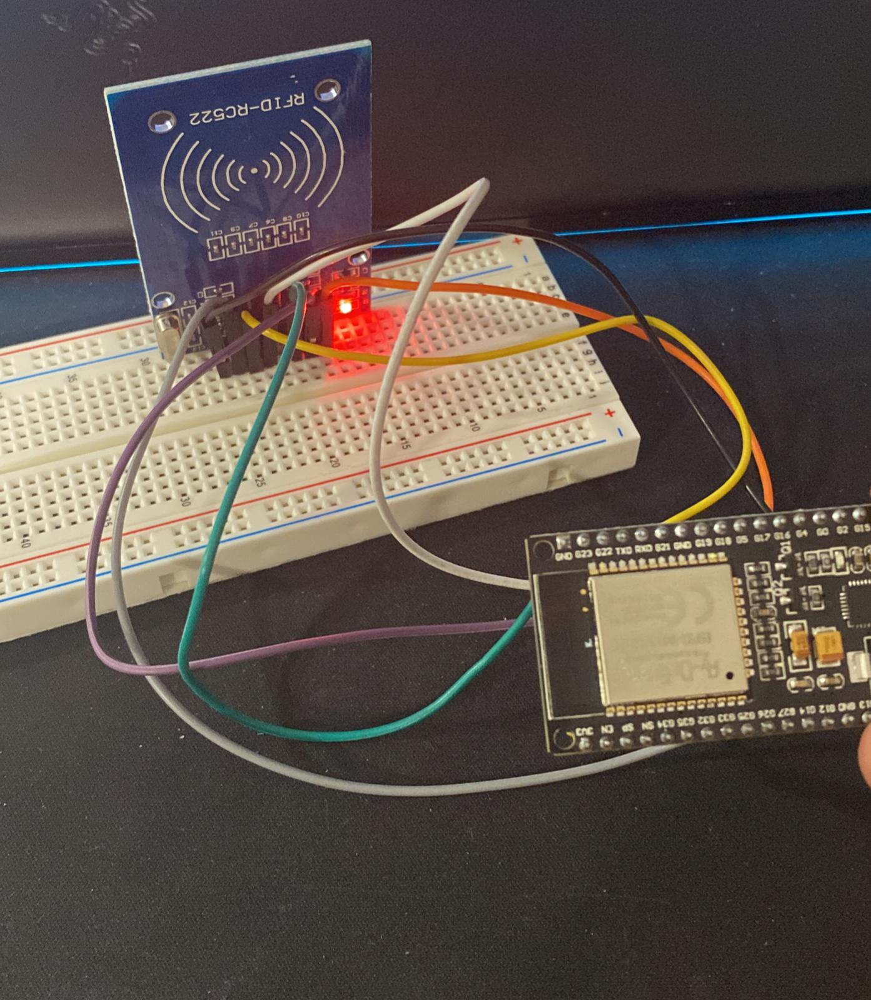

###                                    

    Processadors Digitals

#   PRÁCTICA 6  :  Buses de comunicación II (SPI)

## Materiales
1 ESP32
1 Cable USB
1 Lector SD
1 lectura RFID
1 tarjeta

##   3.1 Código SD
#include <SPI.h>
#include <SD.h>
File myFile;
void setup()
{
Serial.begin(9600);
Serial.print("Iniciando SD ...");
if (!SD.begin(4)) {
Serial.println("No se pudo inicializar");
return;
}
Serial.println("inicializacion exitosa");
myFile = SD.open("archivo.txt");//abrimos el archivo
if (myFile) {
Serial.println("archivo.txt:");
while (myFile.available()) {
Serial.write(myFile.read());
}
myFile.close(); //cerramos el archivo
} else {
Serial.println("Error al abrir el archivo");
}
}
void loop()
{
}

##   3.2 Código RFID

#include <Arduino.h>
#include <Wire.h>
#include <SPI.h>
#include <MFRC522.h>

#define RST_PIN	17    //Pin 9 para el reset del RC522
#define SS_PIN	5  //Pin 10 para el SS (SDA) del RC522

MFRC522 mfrc522(SS_PIN, RST_PIN); //Creamos el objeto para el RC522

//Parameters
const int ipaddress[4] = {103, 97, 67, 25};

//Variables
byte nuidPICC[4] = {0, 0, 0, 0};
MFRC522::MIFARE_Key key;
MFRC522 rfid = MFRC522(SS_PIN, RST_PIN);

void setup() {
  //Init Serial USB
  Serial.begin(115200);
  Serial.println(F("Initialize System"));
  //init rfid D8,D5,D6,D7
  SPI.begin();
  rfid.PCD_Init();

  Serial.print(F("Reader :"));
  rfid.PCD_DumpVersionToSerial();
}

/**
   Helper routine to dump a byte array as dec values to Serial.
*/
void printDec(byte *buffer, byte bufferSize) {
  for (byte i = 0; i < bufferSize; i++) {
    Serial.print(buffer[i] < 0x10 ? " 0" : " ");
    Serial.print(buffer[i], DEC);
  }
}

void readRFID(void ) { /* function readRFID */
  ////Read RFID card

  for (byte i = 0; i < 6; i++) {
    key.keyByte[i] = 0xFF;
  }
  // Look for new 1 cards
  if ( ! rfid.PICC_IsNewCardPresent())
    return;

  // Verify if the NUID has been readed
  if (  !rfid.PICC_ReadCardSerial())
    return;

  // Store NUID into nuidPICC array
  for (byte i = 0; i < 4; i++) {
    nuidPICC[i] = rfid.uid.uidByte[i];
  }

  Serial.print(F("RFID In dec: "));
  printDec(rfid.uid.uidByte, rfid.uid.size);
  Serial.println();

  // Halt PICC
  rfid.PICC_HaltA();

  // Stop encryption on PCD
  rfid.PCD_StopCrypto1();

}
void loop() {
  readRFID();
}

/**
   Helper routine to dump a byte array as hex values to Serial.
*/
void printHex(byte *buffer, byte bufferSize) {
  for (byte i = 0; i < bufferSize; i++) {
    Serial.print(buffer[i] < 0x10 ? " 0" : " ");
    Serial.print(buffer[i], HEX);
  }
}

##   3.3 Observaciones

El circuito RFID funciona tal que al acercar una tarjeta NFC al sensor, este lo detecta y muestra por el terminal el ID que tiene esa tarjeta.

