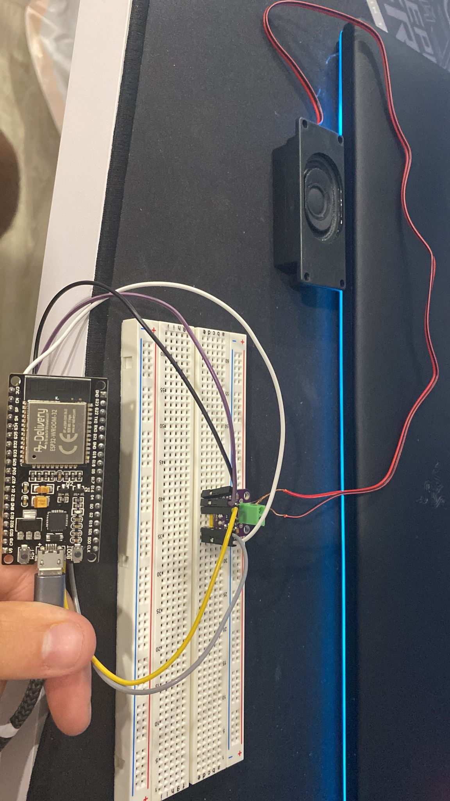

###                                    

    Processadors Digitals

#   PRACTICA 7 : Buses de comunicación III (I2S)

## Materiales
1 Altavoz
1 Amplificador I2C
1 ESP32
1 Cable USB
Cables macho-hembra

##   3.1 Código 

#include "AudioGeneratorAAC.h"
#include "AudioOutputI2S.h"
#include "AudioFileSourcePROGMEM.h"
#include "sampleaac.h"
AudioFileSourcePROGMEM *in;
AudioGeneratorAAC *aac;
AudioOutputI2S *out;
void setup(){
Serial.begin(115200);
in = new AudioFileSourcePROGMEM(sampleaac, sizeof(sampleaac));
aac = new AudioGeneratorAAC();
out = new AudioOutputI2S();
out -> SetGain(0.125);
out -> SetPinout(26,25,22);
aac->begin(in, out);
}
void loop(){
if (aac->isRunning()) {
aac->loop();
} else {
aac -> stop();
Serial.printf("Sound Generator\n");
delay(1000);
}
}

##   3.3 Observaciones

Gracias al codigo adjunto podremos utilizar el altavoz y escuchar una breve melodia que le hemos incorporado previamente.
Primero he conectado el ESP32 al amplificador en todos los puertos necesarios y en segundo lugar he atornillado el altavoz al amplificador.

